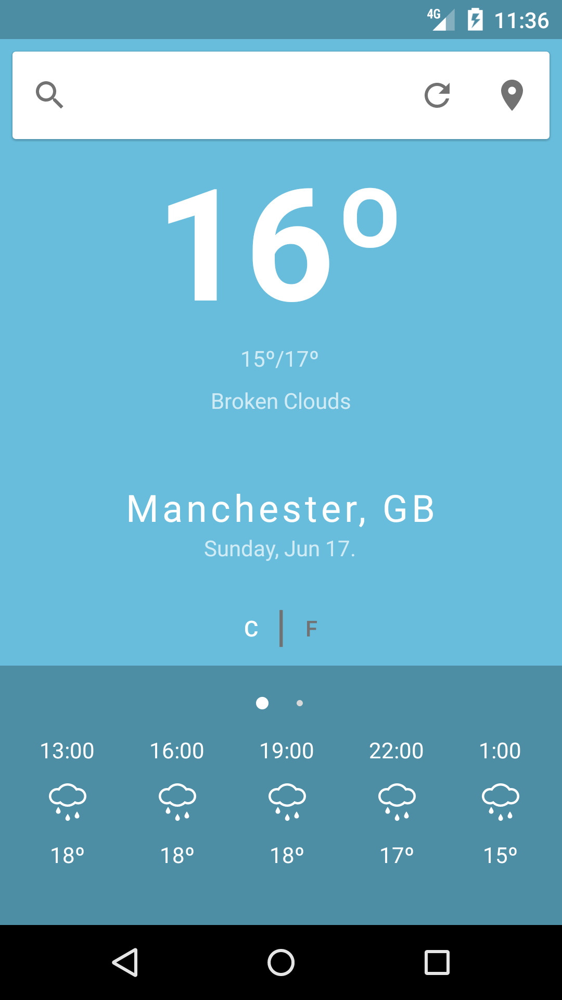
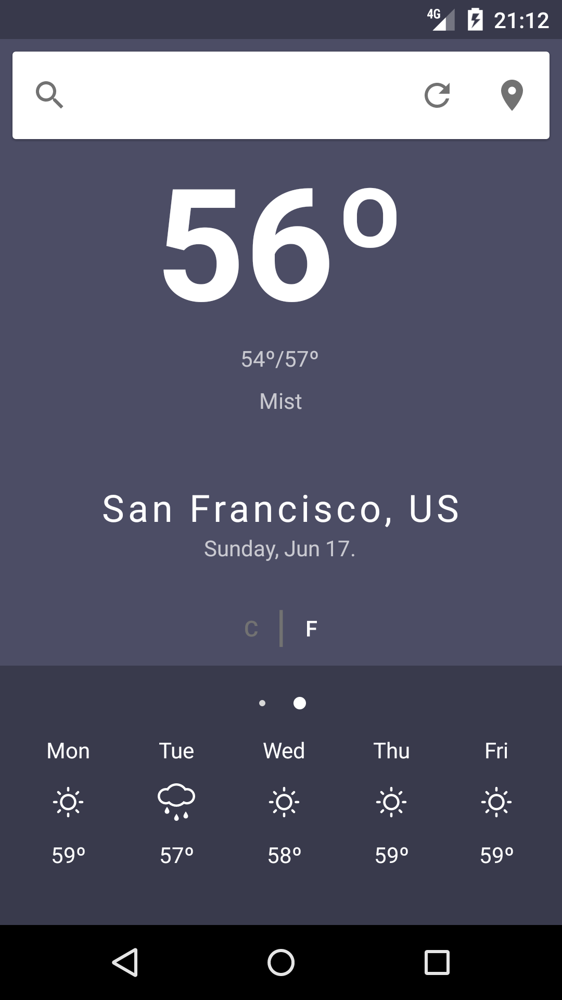
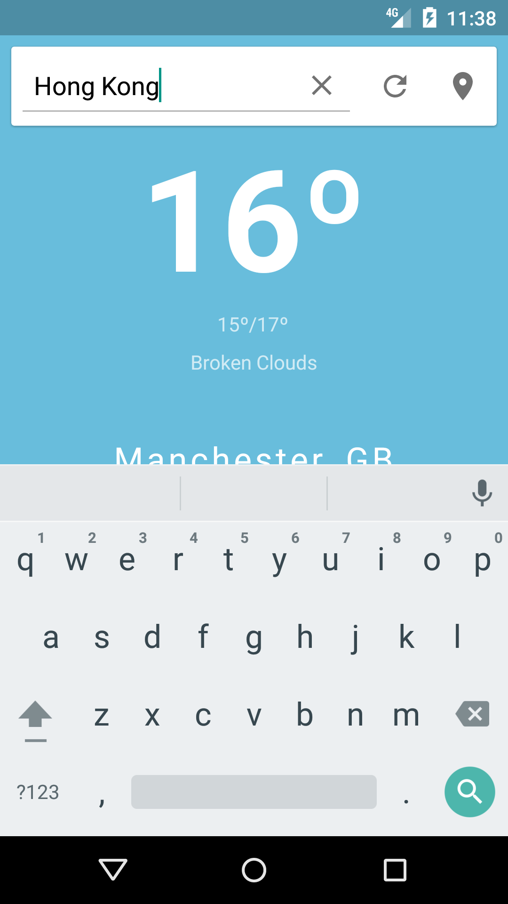

# Clear Weather App
When using existing weather apps on the market I found that they were often overloaded with information that I rarely looked at or made use of. As a result, I decided to create an app that only contained the essentials.

Clear Weather is a minimal weather app for Android devices. The app displays current weather data as well as 3 hourly and 5 day forecasts. All weather data is provided by the [OpenWeatherMap API](https://openweathermap.org/api).

# Features
- Location Aware
- Manual Location Search
- Current Weather
- 3 Hour Forecast
- 5 Day Forecast
- Celsius/Fahrenheit Toggle
- Dynamic Theme

# Screenshots

# Installation

The app requires an API key to be able to retrieve weather data.

1. [Sign up for an API key](https://openweathermap.org/)
2. Create a new XML resource file called `secrets.xml` inside the `app/src/main/res/values` directory.
3. Create a new string resource to store your API key, like so:
`<string name="open_weather_api_key">YOUR API KEY HERE</string>`

# Credits
Weather icons created by [Alessio Atzeni](http://www.alessioatzeni.com/meteocons/)

Weather and forecast data provided by [OpenWeatherMap API](https://openweathermap.org/api).
